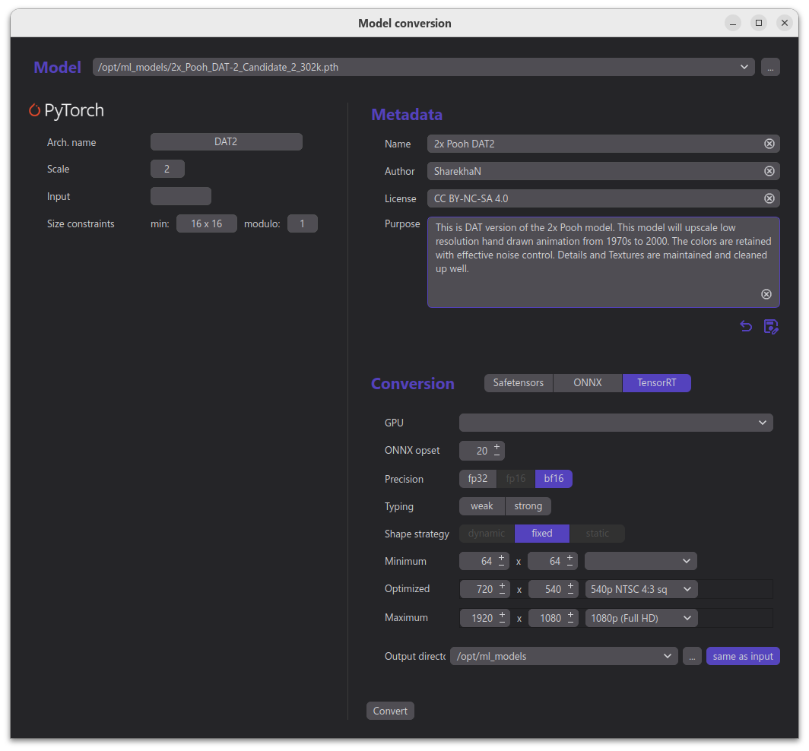

# Herlegon Convert
Tool for converting image and video models between Torch, ONNX, and Safetensors formats, including TensorRT. It also allows adding metadata or injecting it into an existing model file.

