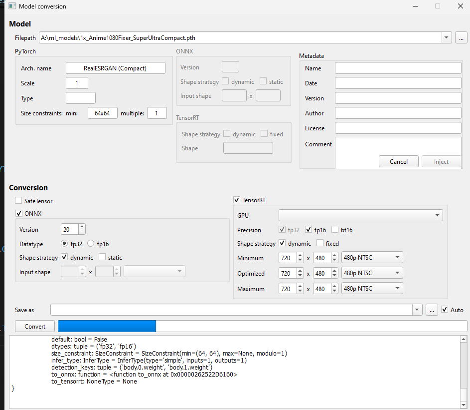

# Herlegon Convert
Tool for converting image and video models between Torch, ONNX, and Safetensors formats, including TensorRT. It also allows adding metadata or injecting it into an existing model file.

📜history
- 2025-11-03: renamed as Herlegon Convert

- 2025-06-25: reworked UI

- 2025-03-30: first draft